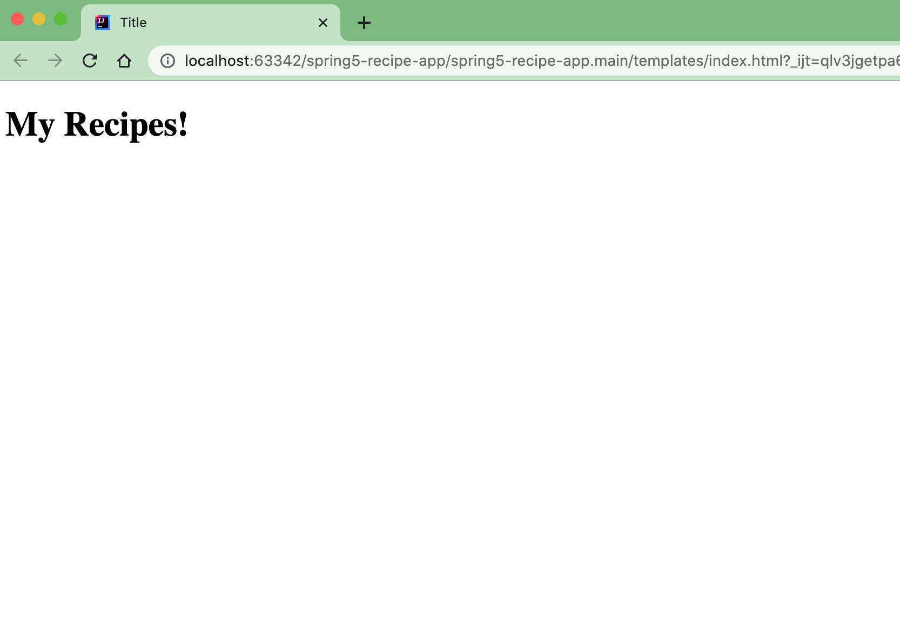

# spring5-recipe-app
## Spring Web app from "Spring Framework 5: Beginner to Guru" udemy course

* Java
* Spring Boot
* spring-boot-starter-data-jpa
* spring-boot-starter-thymeleaf
* spring-boot-starter-web
* spring-boot-devtools
* com.h2database

## Reference
* https://www.udemy.com/course/spring-framework-5-beginner-to-guru/

